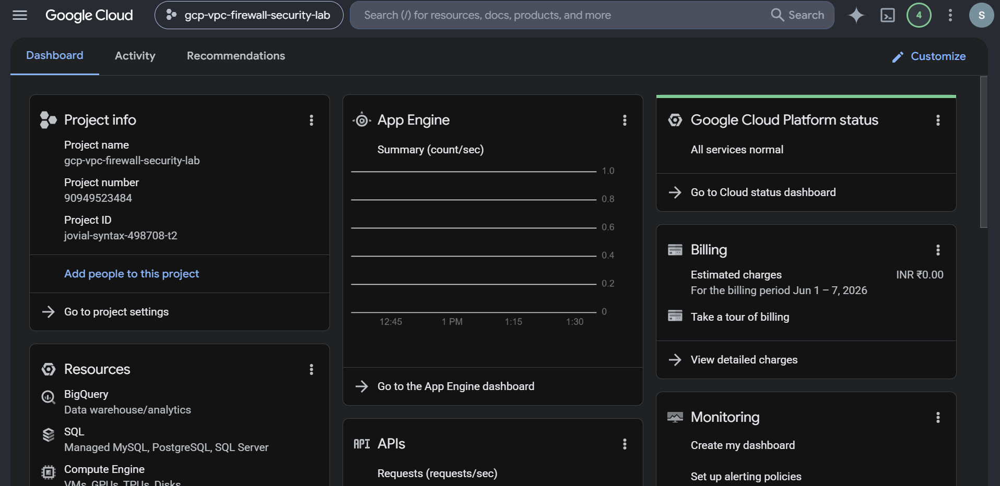
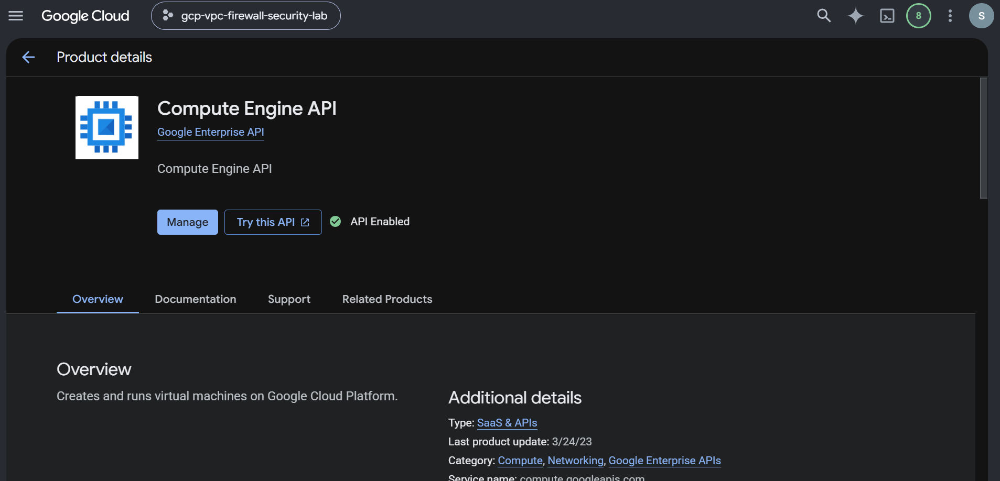
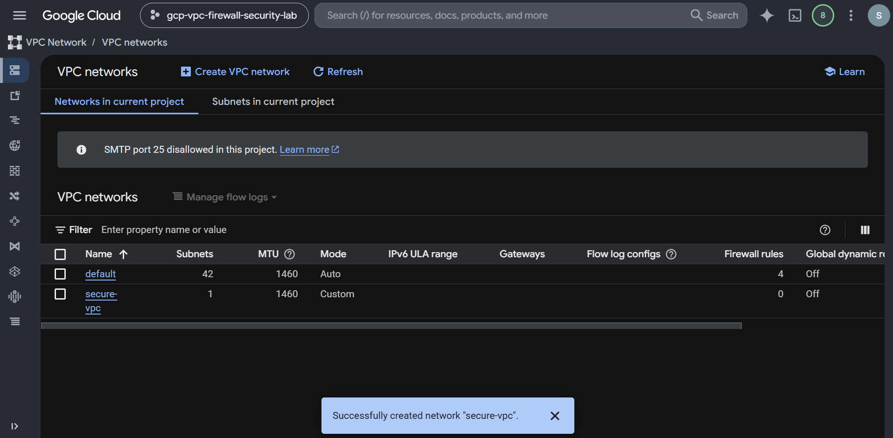
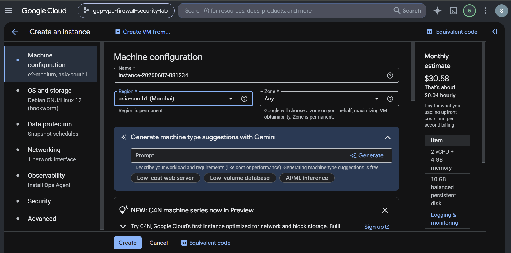
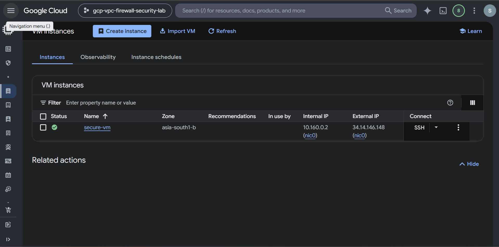
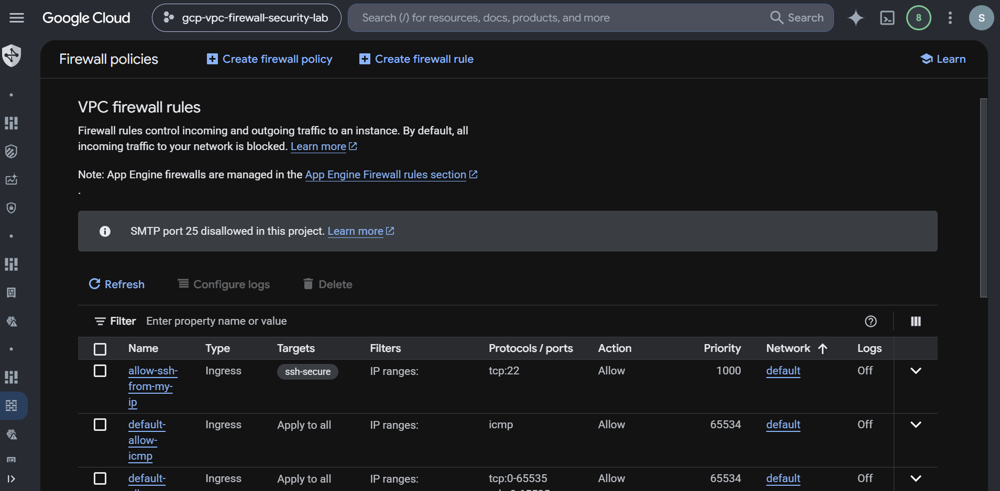
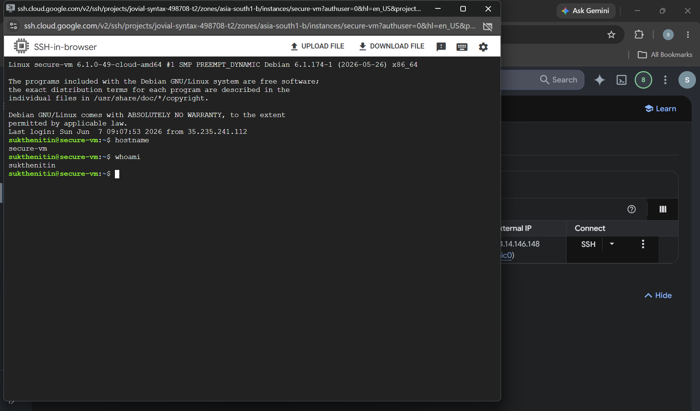
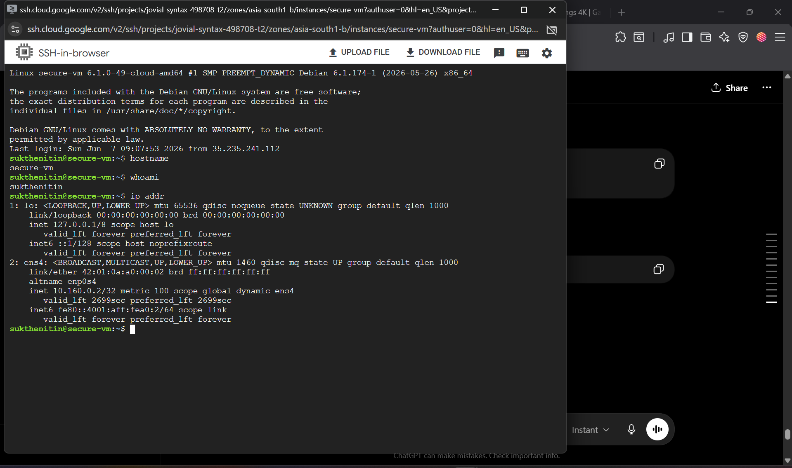
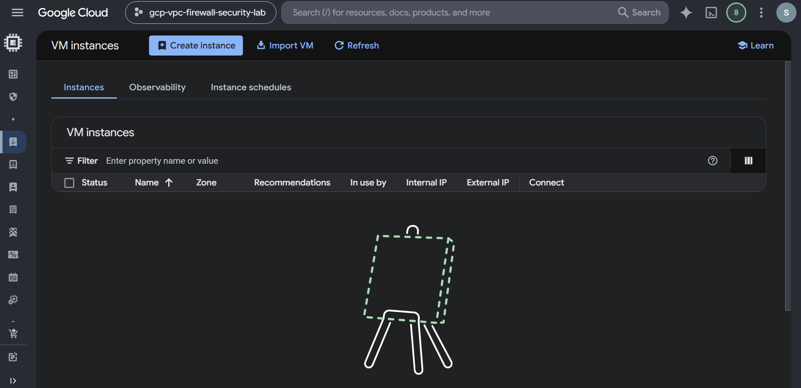
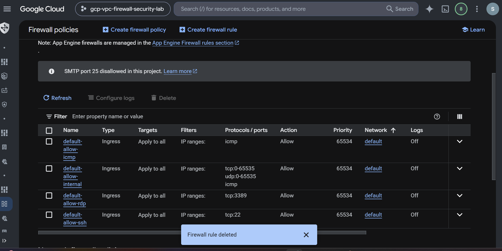

# GCP Firewall Security Lab

## Secure Remote Access Implementation Using Google Cloud VPC Firewall Rules


---

# Project Overview

This project demonstrates the implementation of cloud network security controls within Google Cloud Platform (GCP) by securing a Compute Engine virtual machine using VPC Firewall Rules and IP-based access restrictions.

The primary objective was to reduce the attack surface of a cloud-hosted workload by enforcing the Principle of Least Privilege and restricting SSH administrative access to a single trusted public IP address.

This lab simulates real-world cloud security engineering practices used to protect cloud infrastructure from unauthorized access and network-based attacks.

---

# Project Objectives

* Deploy a Compute Engine virtual machine
* Configure secure network access controls
* Implement VPC firewall security policies
* Restrict SSH access to a trusted public IP
* Apply network tag-based access control
* Validate secure administrative access
* Perform infrastructure security verification
* Implement cloud resource cleanup procedures

---

# Technologies Used

| Category         | Technology                  |
| ---------------- | --------------------------- |
| Cloud Platform   | Google Cloud Platform (GCP) |
| Compute          | Compute Engine              |
| Networking       | VPC Network                 |
| Security         | VPC Firewall Rules          |
| Operating System | Debian Linux                |
| Remote Access    | SSH                         |
| Validation       | Linux Networking Commands   |

---

# Cloud Security Skills Demonstrated

* Google Cloud Platform (GCP)
* Compute Engine Security
* VPC Networking
* Firewall Rule Management
* Network Segmentation
* Secure Remote Administration
* SSH Security
* Access Control
* Principle of Least Privilege
* Attack Surface Reduction
* Infrastructure Validation
* Cloud Resource Cleanup

---

# Project Architecture

```text
                    Internet
                         |
                         |
                 Trusted Public IP
                         |
                         |
              VPC Firewall Rule
             Allow TCP Port 22
                         |
                         |
                  Network Tag
                   ssh-secure
                         |
                         |
                    secure-vm
                 Debian Linux VM
```

---

# Project Workflow

## Step 1 – Create GCP Project

A dedicated Google Cloud project was created to isolate resources and maintain security boundaries.

### Evidence



---

## Step 2 – Enable Compute Engine API

Compute Engine services were enabled to support virtual machine deployment.

### Evidence



---

## Step 3 – Configure Network Environment

A secure VPC networking environment was configured for the cloud workload.

### Evidence



---

## Step 4 – Deploy Compute Engine Instance

A Debian-based Compute Engine virtual machine was deployed.

### Configuration

| Setting      | Value        |
| ------------ | ------------ |
| VM Name      | secure-vm    |
| Machine Type | e2-micro     |
| OS           | Debian Linux |
| Region       | asia-south1  |

### Evidence



---

## Step 5 – Verify Running Infrastructure

The Compute Engine instance was successfully provisioned and validated.

### Evidence



---

## Step 6 – Implement Firewall Security Controls

A custom VPC firewall rule was created to allow SSH access only from a trusted public IP address.

### Firewall Configuration

| Setting    | Value                   |
| ---------- | ----------------------- |
| Rule Name  | allow-ssh-from-my-ip    |
| Direction  | Ingress                 |
| Protocol   | TCP                     |
| Port       | 22                      |
| Target Tag | ssh-secure              |
| Source     | Trusted Public IP (/32) |

### Security Benefit

* Restricts unauthorized SSH access
* Reduces attack surface
* Implements least privilege access

### Evidence



---

## Step 7 – Validate Secure SSH Access

Secure administrative access was successfully validated.

### Validation Commands

```bash
hostname
whoami
```

### Evidence



---

## Step 8 – Verify Network Configuration

The VM network configuration and assigned IP addresses were verified.

### Validation Command

```bash
ip addr
```

### Evidence



---

# Security Assessment

## Risks Mitigated

### Unauthorized Administrative Access

Restricted using IP-based firewall filtering.

### Brute Force Attempts

Reduced by limiting SSH access to a trusted source.

### Network Exposure

Administrative services are not broadly exposed to the Internet.

### Excessive Permissions

Only required access was granted.

---

# Security Best Practices Applied

* Principle of Least Privilege
* Secure Administrative Access
* Firewall-Based Network Security
* Network Segmentation
* Access Restriction by Source IP
* Attack Surface Reduction
* Resource Lifecycle Management

---

# Validation Results

| Validation                     | Status |
| ------------------------------ | ------ |
| Compute Engine Deployment      | PASS   |
| Firewall Rule Creation         | PASS   |
| SSH Access Validation          | PASS   |
| Hostname Verification          | PASS   |
| User Verification              | PASS   |
| Network Interface Verification | PASS   |
| Cleanup Verification           | PASS   |

---

# Cleanup Process

After successful validation, all resources were securely removed.

## VM Removal



## Firewall Removal



### Cleanup Summary

* Compute Engine VM deleted
* Firewall rule deleted
* Temporary resources removed
* Cloud costs eliminated

---

# Documentation

Additional project documentation is available inside the `docs/` directory:

* Project Overview
* Network Architecture
* Firewall Analysis
* SSH Validation
* Security Best Practices
* Cleanup Procedures

---

# Project Outcome

Successfully designed and secured a Google Cloud Compute Engine environment using VPC firewall controls, network-based access restrictions, and least-privilege security principles.

This project demonstrates practical cloud security engineering skills including infrastructure security, network access control, firewall management, and secure cloud administration.

---

# Author

**Nitin Sukthe**

Future Cloud Security Engineer

Focused on Cloud Security, IAM, Network Security, Threat Detection, and Secure Cloud Architecture.
